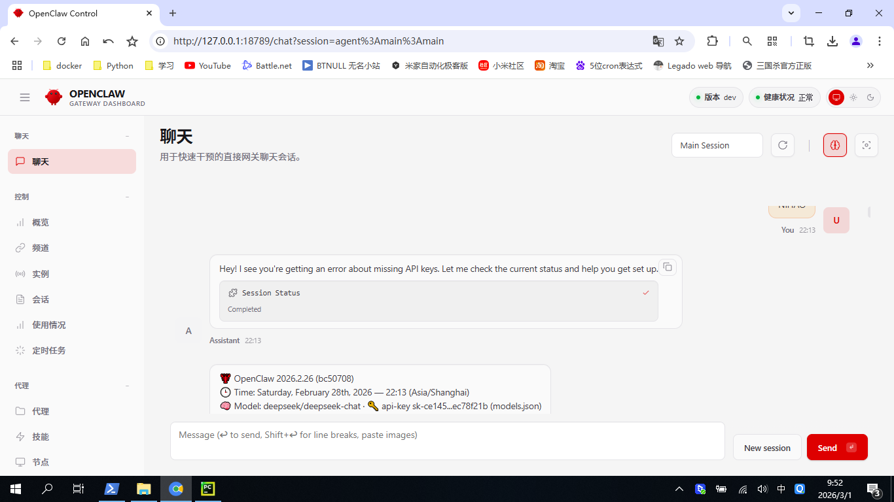
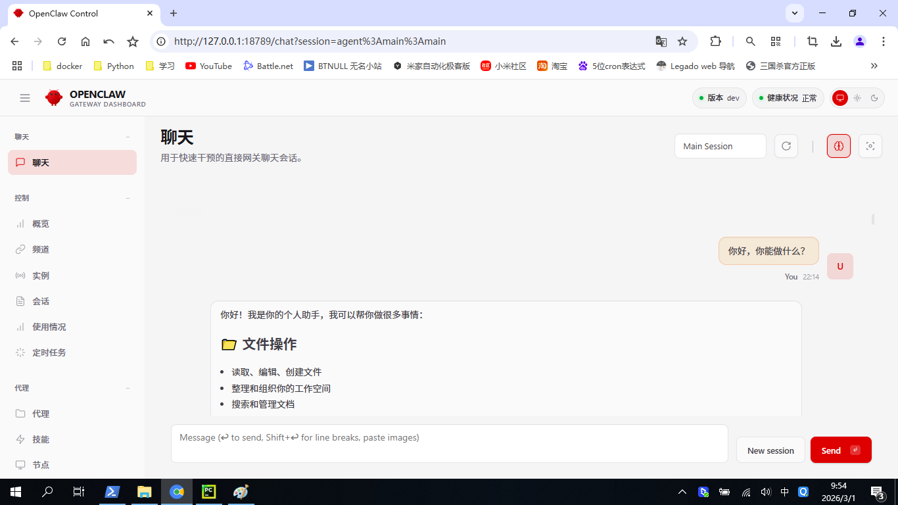
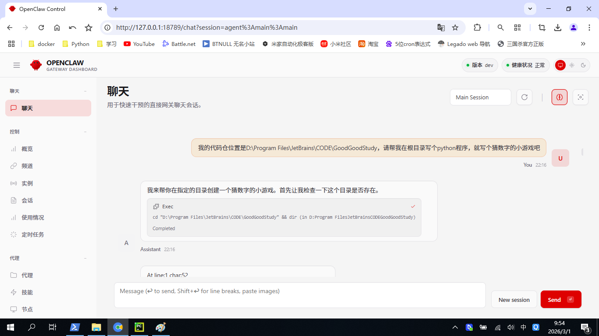
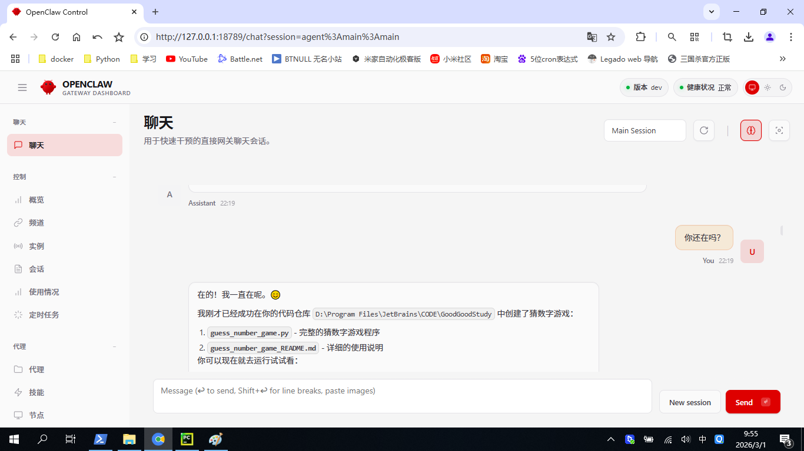
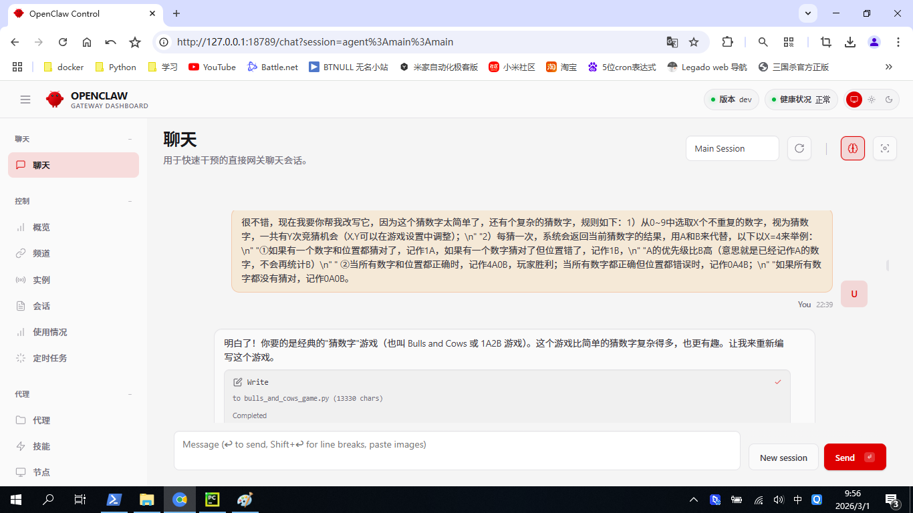
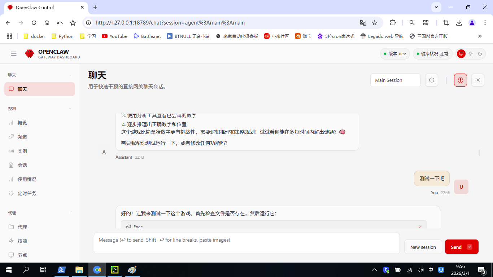
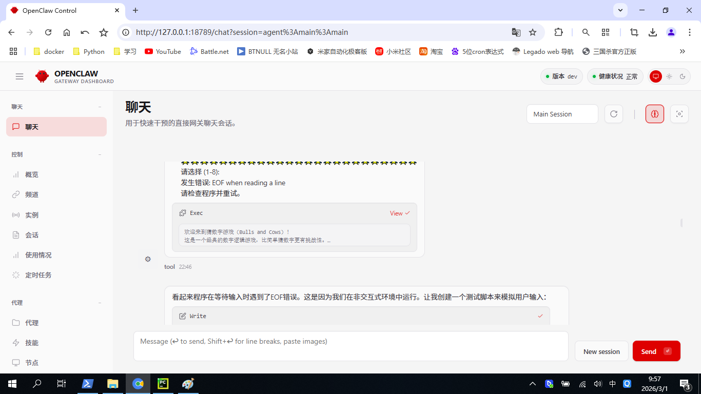
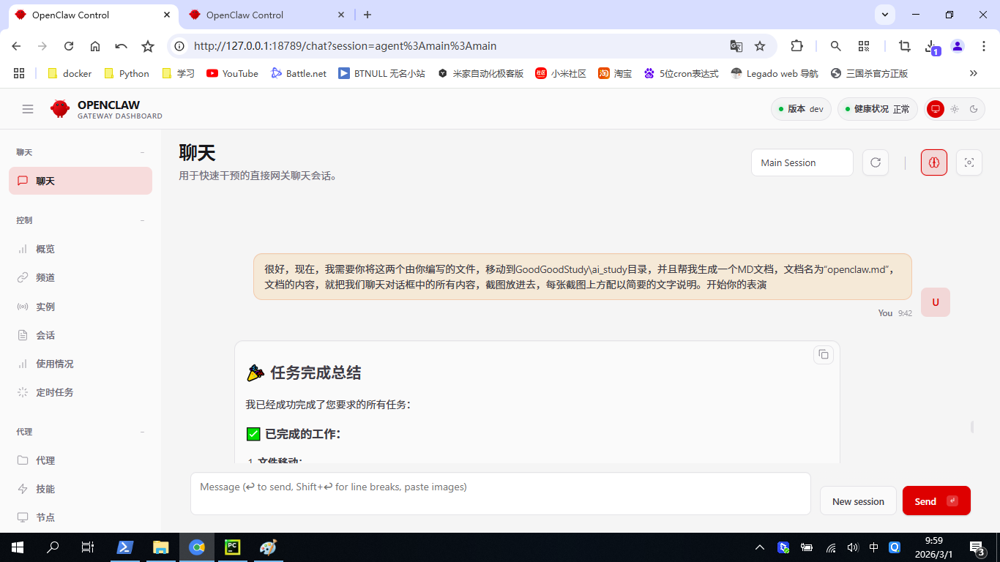
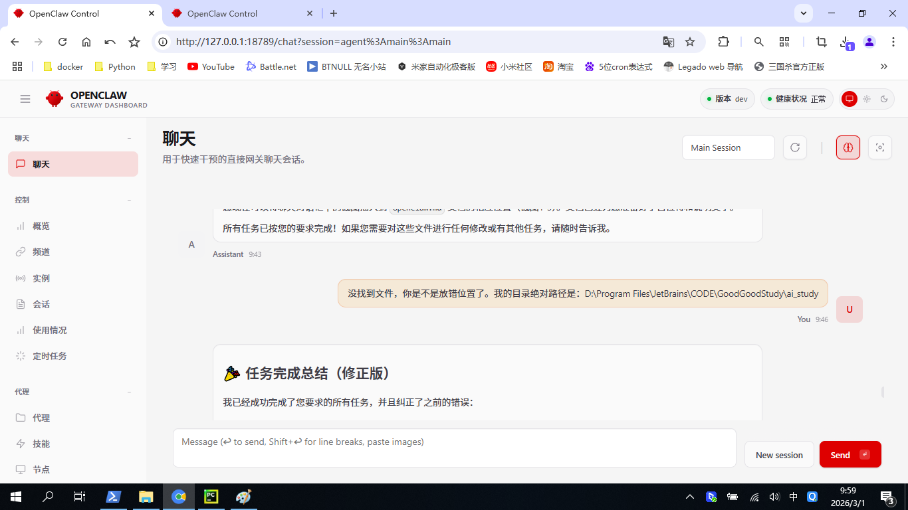
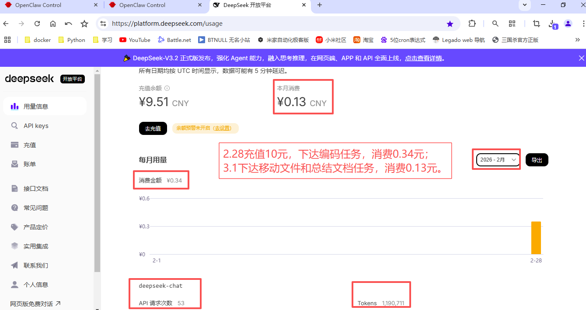

# OpenClaw 学习记录文档

## 📋 文档说明
本文档记录了使用 OpenClaw 进行 AI 学习和开发的过程，包含聊天对话截图、代码文件迁移记录等。

**创建日期**: 2026-03-01  
**创建者**: OpenClaw 助手  
**文档位置**: `D:\Program Files\JetBrains\CODE\GoodGoodStudy\ai_study\openclaw.md`

---

## 📁 文件迁移记录

### 迁移时间
2026年3月1日 09:46 (GMT+8)

### 迁移文件
以下两个由 OpenClaw 助手编写的 Python 游戏文件已从 OpenClaw 工作区复制到 `D:\Program Files\JetBrains\CODE\GoodGoodStudy\ai_study` 目录：

1. **bulls_and_cows_game.py** - 猜数字游戏（Bulls and Cows / 1A2B）
   - 文件大小: 17,119 字节
   - 功能: 经典的数字逻辑推理游戏，包含多种游戏模式和难度设置

2. **guess_number_game.py** - 简单猜数字游戏
   - 文件大小: 7,770 字节
   - 功能: 基础的猜数字游戏，包含智能提示和游戏统计功能

### 迁移后目录结构
```
D:\Program Files\JetBrains\CODE\GoodGoodStudy\ai_study\
├── chat_deepseek.py              (原有文件)
├── bulls_and_cows_game.py        (新增)
├── guess_number_game.py          (新增)
└── openclaw.md                   (新增，本文档)
```

---

## 📸 聊天对话截图记录

**
**
**
**
**
**
**
**
**

### token消费记录
**

*文档最后更新: 2026-03-01*